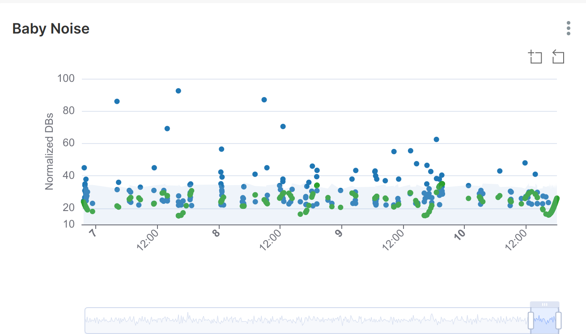

# Baby Noise Monitor

This project is a simple Python script designed to run on a Raspberry Pi with a cheap USB microphone. It's purpose is to monitor noise levels in a baby's room.

## How it Works

The script listens for any noise over a preset threshold (measured in decibels). When such noise is detected, it creates a data point. These data points are then sent to a remote PostgreSQL server for storage and analysis.

## Data Analysis

The PostgreSQL server is run in a Docker container on a separate computer. The data stored in this server can be reviewed and analyzed using Apache Superset, which is also run in a separate Docker container.

Here is a sample of the plots you can generate with this data:

This setup allows for real-time monitoring of noise levels in the baby's room, providing valuable insights into the baby's sleep patterns and potential disturbances.
